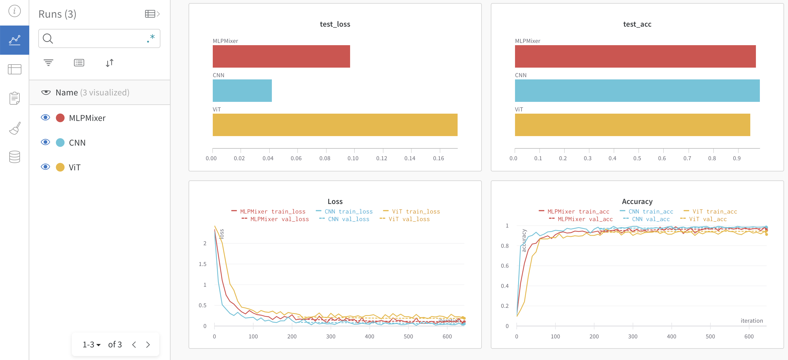

<h1 align="center">
  <b>Deep Lightning</b><br>
</h1>
<p align="center">
    <a href="https://www.python.org"></a>
    <a href= "https://pytorch.org"></a>
    <a href= "https://www.pytorchlightning.ai"></a>
</p>

**Deep Lightning** is a configuration-based wrapper for training Deep Learning models with focus on parallel training, cross-platform compatibility and reproducibility. The philosophy is simple: from configuration to trackable and reproducible deep learning.

After defining modules and configuration, training deep learning models is simple:
<p align="left">
  
</p>

# Overview

### Features
- Simplified trainer with **PyTorch-Lightning**
- Experiment tracking and logging with **Weights and Biases**
- Deployment (prediction API) with **FastAPI**
- Memory-efficient parallel training with **DeepSpeed**

# Installation

Pre-requirement: Anaconda (installation instructions [here](https://docs.anaconda.com/anaconda/install)).

Clone repo:
```bash
git clone https://github.com/pme0/DeepLightning.git
cd DeepLightning
```

Create conda environment:
```bash
conda env create -f env.yaml
conda activate dl
```

# Usage

## Run

### Train

For model **training** set `stages.train.active: True` in the config and use
```bash
python run.py \
  --config-name CONFIG_NAME.yaml \
  --config-path CONFIG_PATH.yaml \
```
where `config-path` defaults to `configs/` and `config-name` is the config filename.
For example, `python run.py --config-name SymbolRecognition.yaml`.

To create your own config follow the [Configuration guidelines](#configure) or see [Examples](#examples).

### Test

For model **testing** use the same command as training but set `stages.test.active: True` and provide a path to the model weights in `stages.test.ckpt_test_path`.

### Monitor

Monitor training run and evaluation metrics on W&B web interface:



### Deploy

Deploy the model with
```bash
python -m api.serve <run-dir>
```
where `run-dir` is the wandb run directory containing training artifacts inside folder `files`. The artifacts required to launch the API are the config (`cfg.yaml`) and the model weights (`*.ckpt`). If there are more than one `.ckpt` file inside the artifacts directory, the exact checkpoint file must be provided with the argument `--ckpt_name`.
For example, `python -m api.serve wandb/run-20230224_215446-6raddysk`.

Then use the API as follows
```bash
curl -X 'POST' 'http://127.0.0.1:5000/predict/' -F 'file=@<path-to-image>'
```

## Configure

### Logic
All config fields labelled `target` correspond to target classes. The format is `MODULE.CLASS` and the code will load class `CLASS` from `MODULE.py` (relative path). Note that `MODULE` can itself be composite, `X.Y.Z`, in which case the class `CLASS` will be loaded from `X/Y/Z.py`. 
For example, `model.optimizer.target` could be existing `deepspeed.ops.adam.FusedAdam` or user-defined in `losses.custom.MyLoss`.

For example, the following config would initialise `AwesomeCNN` model from `deeplightning.models.cnn` module with arguments `num_classes=100` and `num_channels=3`:
```yaml
task:
  name: image_classification
  model:
    target: deeplightning.models.cnn.AwesomeCNN
    args:
      num_classes: 100
      num_channels: 3
```

### Customize

> Make sure you're familiar with the [configuration logic](#logic).

Beyond changing parameters values for existing pipelines, you can customize the pipeline. For example:
- **custom task**: put your task module in `deeplightning/tasks/`, and update the config field `task.name`. This must be a `lightning.LightningModule` class defining the task training logic.
- **custom dataset**: put your data module in `deeplightning/datasets/`, and update the config field `data.module.target` to point to your data module. This must be a `lightning.LightningDataModule` class defining the dataset processing logic.
- **custom model**: put your model in `deeplightning/models/`, and update the config field `task.model.target` and any required parameters to point to your new model. This must be a `torch.nn.Module` class.

And similarly for loss function, optimizer, scheduler, etc.
