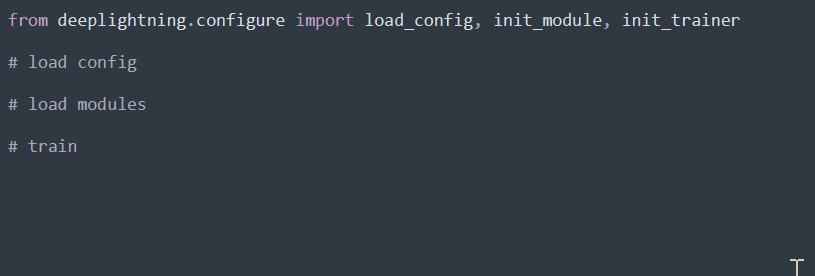
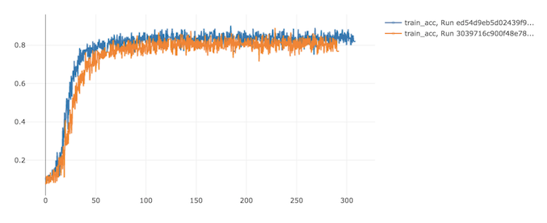

<h1 align="center">
  <b>Deep Lightning</b><br>
</h1>
<p align="center">
    <a href="https://www.python.org"></a>
    <a href= "https://pytorch.org"></a>
    <a href= "https://www.pytorchlightning.ai"></a>
    <a href= "https://www.deepspeed.ai"></a>
    <a href= "https://mlflow.org"></a>
</p>

**Deep Lightning** is a configuration-based wrapper for training Deep Learning models with focus on parallel training, cross-platform compatibility and reproducibility. The philosophy is simple: from configuration to trackable and reproducible deep learning.

After defining modules and configuration, training deep learning models is simple:
<p align="left">
  
</p>

<!--
```python
from deeplightning.configure import load_config, init_module, init_trainer

# load configuration
cfg = load_config("cfg.yaml")

# load modules
model = init_module(cfg, "model")
data = init_module(cfg, "data")
trainer = init_trainer(cfg)

# train model
trainer.fit(model, data)
```
-->


### Contents
* [Overview](overview)
* [Installation](#installation)
* [Usage](#usage)
  * [Run](#run)
  * [Configure](#configure)
  * [Customize](#customize)
* [Examples](#examples) 
* [Results](#results) 
* [Development](#development)
* [Further Reading](#further-reading)

# Overview

### Features
- Simplified trainer with **PyTorch-Lightning**
- Memory-efficinet parallel training with **DeepSpeed**
- Experiment tracking and cross-platform reproducibility with **MLflow**
- Deployment (prediction API) with **Flask**
- Implementations of popular models {**ResNet**, **ViT**, ++soon!}

> See [Development](#development) for a list of functionalities.

# Installation

Pre-requirement: Anaconda (installation instructions [here](https://docs.anaconda.com/anaconda/install)).

All dependencies in the environment `conda_env.yaml` will be installed automatically when running the `MLproject` file via MLflow (see [Usage](#usage)). Only basic requirements are needed to run the project:
```bash
bash install.sh
```

Optionally, creating the environment manually makes it available also for development:
```bash
conda env create -f conda_env.yaml
conda activate deeplightning
```

# Usage

## Run

**1. Train the model:**
```bash
bash train.sh <cfg>

# Example: 
# bash train.sh configs/classif_cnn.yaml
```
- `cfg` is the configuration file (default: `configs/base.yaml`).
<!-- #mlflow run . -P config=configs/your-cfg.yaml -->

This will run the MLflow project file `MLproject` (setup conda env & run scripts).
Create your own config following [Configuration](#configure) or see [Examples](#examples) for a list of provided configs.

**2. Monitor the training progress:**
```bash
bash monitor.sh
```
<!-- mlflow ui -->
This will allow you to track logged metrics in real-time and compare metrics across multiple runs/configurations:



**3. Deploy the model:**
```bash
bash deploy.sh <artifact-storage-path>

# Example:
# bash deploy.sh /mlruns/0/6ff30d9bc5b74c019071d575fec86a19/artifacts
```
- `artifact-storage-path` is the path where artifacts were stored during training, which contains the train config (`cfg.yaml`) and model checkpoint (`last.ckpt`);

**4. Predict using the API:**
```bash
bash predict.sh <image>

# Example:
# bash predict.sh image.jpg
```
- `image` is the path to the image to be predicted;

## Configure

### \*Logic

All config fields labelled `type` correspond to target classes. The format is `MODULE.CLASS` and the code will load class `CLASS` from `MODULE.py` (relative path). Note that `MODULE` can itself be composite, `X.Y.Z`, in which case the class `CLASS` will be loaded from `X/Y/Z.py`. 
For example, `model.optimizer.type` could be existing `deepspeed.ops.adam.FusedAdam` or user-defined in `losses.custom.MyLoss`.

<!--It's possible to drop some of the parameters to obtain a light config file, see `deeplightning/defaults.py`. 
For reproducibility and transparancy, parameters that affect training are not granted defaults.-->

### Details
- `data` requires 
    - `root` folder; 
    - `dataset` name;
    - `num_workers` in the dataloader; 
    - `batch_size`for each iteration; 
    - `module` requires:
        -  `type`, target class of type [LightningDataModule](https://pytorch-lightning.readthedocs.io/en/stable/extensions/datamodules.html) (takes the full config as input), in the format explained above;\*
- `model` requires:
    - `module` requires:
        -  `type`, target class of type [LightningModule](https://pytorch-lightning.readthedocs.io/en/stable/common/lightning_module.html) (takes the full config as input), in the format explained above;\*
    - `network`,`optimizer`,`scheduler`,`loss` require:
        - `type`, target class in the format explained above;\*
        - `params`, parameters for that class with matching keywords; include an empty `params` field if no parameters are required; 
        - note: `scheduler` requires additional `call` field with subfields `interval` (equal to `step` or `epoch`) and `frequency` (no. steps or epochs) for when to make a scheduler update;
- `engine` requires computational engine parameters:
    - `backend`, parallel backend {`deepspeed_stage_1`, `deepspeed_stage_2`, `deepspeed_stage_3`} for [DeepSpeed](https://pytorch-lightning.readthedocs.io/en/latest/advanced/advanced_gpu.html#deepspeed) backend or `ddp` for [DataParallel](https://pytorch-lightning.readthedocs.io/en/latest/api/pytorch_lightning.strategies.DDPStrategy.html#pytorch_lightning.strategies.DDPStrategy) backend;
    - `gpus` is `null` for CPU-training or a list of gpu ids `[0,1]` for GPU-training;
    - `num_nodes`, the number of computational nodes;
    - `precision`, floating-point precision {`16`, `32`};
- `train` training parameters;
  - num_epochs: 10

- `logger` requires {`type`,`params`}, format similar to `model`; and other parameters related to logging;
 
### Example
```python
#@filename: cfg.yaml

data:
  root: /data
  dataset: MNIST
  module:
    type: deeplightning.data.mnist.MNIST
  num_workers: 4
  batch_size: 256
   
model:
  module:
    type: deeplightning.task.img_classif.ImageClassification
  network:
    type: deeplightning.model.cnn.SimpleCNN
    params: 
      num_classes: 10
      num_channels: 1
  optimizer:
    type: torch.optim.SGD
    params:
      lr: 0.01
      weight_decay: 0.01
      momentum: 0.9
  scheduler:
    type: torch.optim.lr_scheduler.ExponentialLR
    params:
      gamma: 0.99
    call:
      interval: "epoch"
      frequency: 1
  loss:
    type: torch.nn.CrossEntropyLoss
    params:

engine:
  backend: deepspeed_stage_3
  gpus: [0,1]
  num_nodes: 1
  precision: 32

train:
  num_epochs: 10
  val_every_n_epoch: 1
  accumulator_epoch: 0
  accumulator_factor: 1
  resume_ckpt: null

logger:
  type: pytorch_lightning.loggers.MLFlowLogger
  params:
    experiment_name: Default
    tracking_uri: mlruns
  log_every_n_steps: 10
```

### Customize

> Make sure you're familiar with the [configuration logic and details](#configure)!

Beyond changing parameters values in existing configs, you can customize the following according to your needs:
- **custom model**: put your model in `models/customnet.py`, and update the config field `model.network.type` and any required parameters to point to your new model;
- **custom task**: duplicate the task module `lightning/model/classification.py`, rename it `lightning/model/customtask.py`, make the required modifications to run your task, and update the config field `model.module.type` to point to your new task module;
- **custom dataset**: duplicate the data module `lightning/data/mnist.py`, rename it `lightning/data/customdataset.py`, make the required modifications to load your dataset, and update the config field `data.module.type` to point to your new data module;


# Examples

See [`examples`](https://github.com/pme0/DeepLightning/tree/master/examples) for details.

# Results

[results on acceleration, memory use, etc.]

# Development

### Functionalities
- [x] tracking logger (losses, learning rate, etc.)
- [x] artifact storing (config, image, figure - TODO histogram)
- [x] parallel training
  - [x] multi-gpu
  - [x] multi-node
  - [x] backend engines:
    - [x] ddp
    - [x] deepspeed_stage_1 
    - [x] deepspeed_stage_2
    - [ ] deepspeed_stage_3 (TODO resuming, sharded initialization)
- [x] 16-bit precision
- [x] periodic model checkpoints
- [ ] resume training from model checkpoint --- `deepspeed` untested [[docs](https://pytorch-lightning.readthedocs.io/en/stable/advanced/advanced_gpu.html#deepspeed)] [[docs](https://pytorch-lightning.readthedocs.io/en/stable/advanced/advanced_gpu.html#collating-single-file-checkpoint-for-deepspeed-zero-stage-3)];
- [ ] sharded loading via LightningModule hook `configure_sharded_model(self):` [[docs](https://pytorch-lightning.readthedocs.io/en/latest/advanced/model_parallel.html#enabling-module-sharding-for-maximum-memory-efficiency)];
- [x] gradient accumulation
- [x] early stopping
- [x] prediction API [TODO: add batch support]
- [ ] multiple losses/optimizers e.g. GAN; [[docs](https://pytorch-lightning.readthedocs.io/en/stable/common/lightning_module.html?highlight=configure_optimizers#configure-optimizers)]; though deepspeed doesn't allow this atm "DeepSpeed currently only supports single optimizer, single scheduler within the training loop." [[docs](https://pytorch-lightning.readthedocs.io/en/stable/advanced/advanced_gpu.html#deepspeed)]
- [x] reproducible examples
  - [x] image classification
  - [x] image reconstruction

### Notes
- :triangular_flag_on_post: on `mlflow==1.23.1`, initialization causes the folder `mlruns` to be created automatically, which is a nuisance if you want to log to a different folder. Mentioned in issue [#3400](https://github.com/mlflow/mlflow/issues/3400) and addressed in pull request [#3410](https://github.com/mlflow/mlflow/pull/3410) --- confirm on next release;
- :triangular_flag_on_post: on `deepspeed=0.5.10`, optimizer `deepspeed.ops.adam.FusedAdam` gives `AssertionError: CUDA_HOME does not exist, unable to compile CUDA op(s)`. Mentioned in issue [#1279](https://github.com/microsoft/DeepSpeed/issues/1279);
- :warning: effective batch size is `batch * num_gpus * num_nodes` [[docs](https://pytorch-lightning.readthedocs.io/en/stable/advanced/multi_gpu.html#batch-size)] but huge batch size can cause convergence difficulties [[paper](https://arxiv.org/abs/1706.02677)];
- :warning: deepspeed single-file checkpointing requires caution [[docs](https://pytorch-lightning.readthedocs.io/en/latest/advanced/advanced_gpu.html#collating-single-file-checkpoint-for-deepspeed-zero-stage-3)] [[docs](https://pytorch-lightning.readthedocs.io/en/stable/api/pytorch_lightning.plugins.training_type.DeepSpeedPlugin.html)]


# Further Reading

- **DeepSpeed** 
  - DeepSpeed is a distributed backend which reduces the training memory footprint with a Zero Redundancy Optimizer (ZeRO). It partitions model states and gradients to save memory, unlike traditional data parallelism where memory states are replicated across data-parallel processes. This allows training of large models with large batch sizes.
  - :information_source: [website](https://www.deepspeed.ai)  :floppy_disk: [github](https://github.com/microsoft/DeepSpeed)  :page_with_curl: [ZeRO-3](https://arxiv.org/abs/1910.02054)
- **PytorchLightning**
  - PyTorch-Lightning organizes PyTorch code into hardware-agnostic, loop-less modules to make development quicker and less error-prone. It separates model from backend engine, making deep learning scalable to any distributed hardware, seemlessly.
  - :information_source: [website](https://www.pytorchlightning.ai)  :floppy_disk: [github](https://github.com/PyTorchLightning/pytorch-lightning)
- **MLflow** 
  - MLflow machine learning experimentation cycle manager. Manage project environments and dependencies, reproduce experiments on any platform, track and visualize metrics during training, record and query experiment results.
  -  :information_source: [website](https://mlflow.org)  :floppy_disk: [github](https://github.com/mlflow/mlflow)
- **Flask**
  - Flask is a server-side web framework that supports building and deploying web applications such as ML prediction APIs.
  - :information_source: [website](https://flask.palletsprojects.com)  :floppy_disk: [github](https://github.com/pallets/flask)


