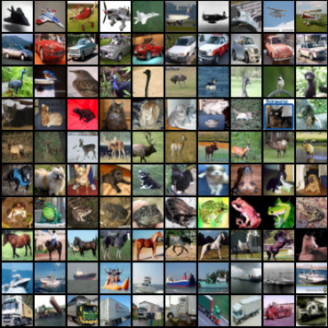
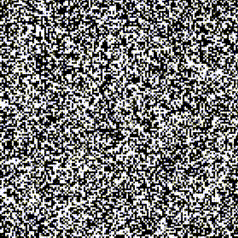
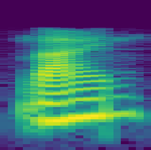
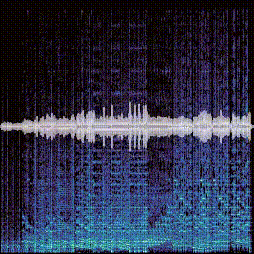
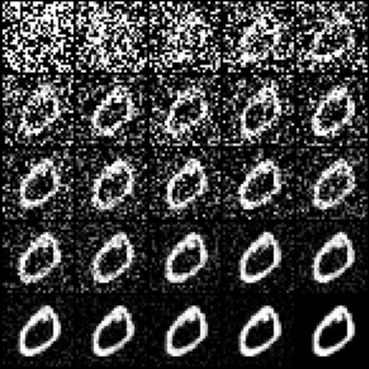

# Examples

**click the images thumbnails** to go to the example page

| ... #ObjectTracking |  #ObjectDetection | Example |
|:---:|:---:|:---:|
|  |   |  |

| Object Recognition #ImageClassification #CNN | ... #ImageReconstruction #VAE | Symbol Generation #ImageGeneration #GAN |
|:---:|:---:|:---:|
|  |  |   |

| Spoken Word Recognition #AudioClassification #CNN | Music Genre Recognition #AudioClassification #RNN  | Example |
|:---:|:---:|:---:|
|  |   |  |

# Reproducible Examples

| Task                     | Model                            | Command                                 |
| ------------------------ | -------------------------------- | --------------------------------------- |
| Classification           | Convolutional Network (CNN)      | `sh train.sh classif_cnn.yaml`          |
| Classification           | Residual Network (ResNet)        | `sh train.sh classif_resnet.yaml`       |
| Classification           | Vision Transformer (ViT)         | `sh train.sh classif_vit.yaml`          |
| Reconstruction           | Vector Quantized VAE (VQVAE)     | `sh train.sh recon_vqvae.yaml`          |

# Tasks

`pl.LightningModule` classes are available for the following tasks. Use the corresponding *Module* in the YAML config field `model.module.target`.

| Task                        | Module                                            | Tracked variable                                                      |
| --------------------------- | --------------------------------------------------| --------------------------------------------------------------------- |
| **Classification**          | `modules.task.img_classif.ImageClassification`    | {train_loss, val_loss, train_acc, val_acc, lr}                        |
| **Reconstruction**          | `modules.task.img_recon.ImageReconstruction`      | {train_loss, val_loss, train_recon, val_recon, {TODO: codebook}, lr}  |

# Models

`torch.nn.Module` classes are available for the following models. Use the corresponding *Module* in the YAML config field `model.network.target`.

| Model                    | Module                             | Sources                                     |
| ------------------------ | ---------------------------------- | ------------------------------------------- | 
| **CNN**                  | `models.cnn.simple_cnn`            |                                             |
| **ResNet18**             | `models.resnet.resnet18`           | [paper][resnet] / [code][resnet_code]       |
| **ResNet34**             | `models.resnet.resnet34`           | [paper][resnet] / [code][resnet_code]       |
| **ResNet50**             | `models.resnet.resnet50`           | [paper][resnet] / [code][resnet_code]       |
| **ResNet101**            | `models.resnet.resnet101`          | [paper][resnet] / [code][resnet_code]       |
| **ResNet152**            | `models.resnet.resnet152`          | [paper][resnet] / [code][resnet_code]       |
| **ResNeXt50_32x4d**      | `models.resnet.resnext50_32x4d`    | [paper][resnext] / [code][resnet_code]      |
| **ResNeXt101_32x8d**     | `models.resnet.resnext101_32x8d`   | [paper][resnext] / [code][resnet_code]      |
| **WideResNet50_2**       | `models.resnet.wide_resnet50_2`    | [paper][wideresnet] / [code][resnet_code]   |
| **WideResNet101_2**      | `models.resnet.wide_resnet101_2`   | [paper][wideresnet] / [code][resnet_code]   |
| **ViT**                  | `models.vit.VisionTransformer`     | [paper][vit] / [code][vit_code]             |
| **VQVAE**                | `models.vqvae.DiscreteVAE`         | [paper][vqvae] / [code][vqvae_code]         |

# Datasets

`pl.LightningDataModule` classes are available for the following datasets. Use the corresponding *Module* in the YAML config field `data.module.target`.

| Dataset                 | Module                                             | 
| ----------------------- | -------------------------------------------------- | 
| **MNIST**               | `modules.data.mnist.MNIST`               | 
| **CIFAR10**             | `modules.data.cifar10.CIFAR10`           | 

[resnet]: https://arxiv.org/abs/1512.03385
[resnext]: https://arxiv.org/abs/1611.05431
[wideresnet]: https://arxiv.org/abs/1605.07146
[resnet_code]: https://pytorch.org/vision/stable/_modules/torchvision/models/resnet.html
[vit]: https://arxiv.org/abs/2010.11929
[vit_code]: https://pytorch-lightning.readthedocs.io/en/latest/notebooks/course_UvA-DL/11-vision-transformer.html
[vqvae]: https://arxiv.org/abs/1711.00937
[vqvae_code]: https://github.com/lucidrains/DALLE-pytorch
[mlpmixer]: https://arxiv.org/abs/2105.01601

