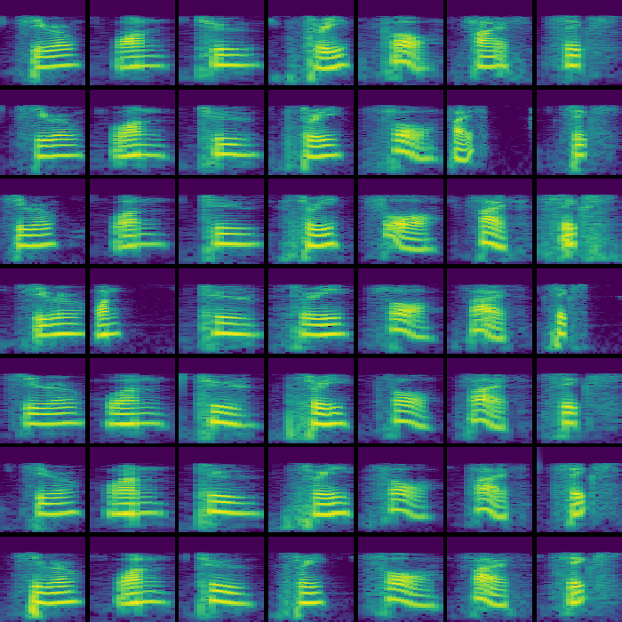

# Examples

**click thumbnails** to go to the example page

| | | |
|:---:|:---:|:---:|
| **-------[ ... ]-------** #ObjectTracking | **-------[ ... ]-------** #ObjectDetection | **-------[ ... ]-------** #InstanceSegmentation |
|  |   |  |
| **------[ Object Recognition ]------** #ImageClassification #CNN #ViT | **-------[ ... ]-------** #ImageReconstruction #VAE | **------[ Symbol Generation ]------** #ImageGeneration #GAN |
|  |  |   |
| **----[ Spoken Word Recognition ]----** #AudioClassification #CNN | **----[ Music Genre Recognition ]----** #AudioClassification #RNN  | **-------[ ... ]-------** # |
|  |   |  |

