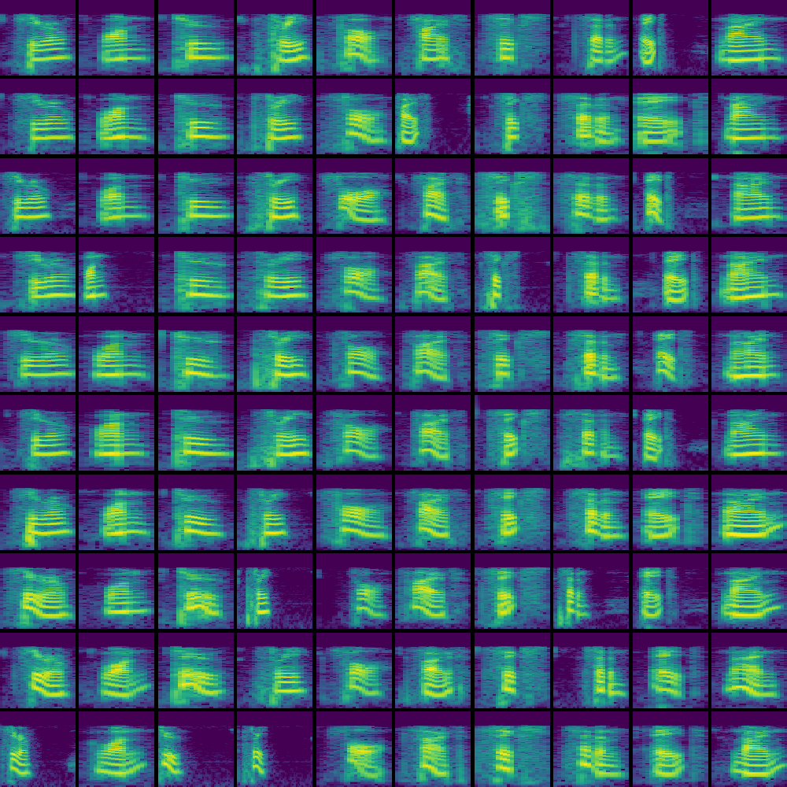
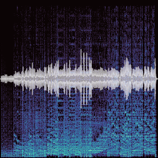

# Examples

**click thumbnails** to go to the example page

| | | |
|:---:|:---:|:---:|
| **[ xTracking ]**  #video  | **[ xDetection ]** #video | **[ xSegmentation ]** #image |
|  |   |  |
| **[ Object Recognition ]** #CNN #ViT #image | **[ ... ]** #VAE #image | **[ Symbol Generation ]** #GAN #image|
|  |  |   |
| **[ Spoken Word Recognition ]** #CNN #audio | **[ Music Genre Recognition ]** #RNN #audio | **[ ... ]** # |
|  |   |  |

