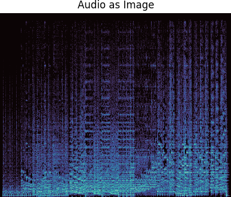
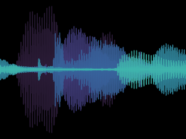
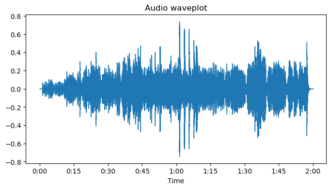
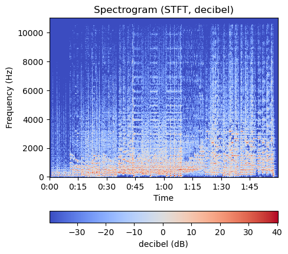

# Audio Classification

  
   
  

|CNN | RNN  | 
|:---:|:---:|
|  |  |
| Audio as Image | [Audio as Sequence](#audio-as-sequence-rnn) |

## 1. Audio as Image - Convolutional Neural Network

  
 
  

## 2. Audio as Sequence - Recurrent Neural Network
