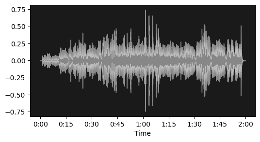
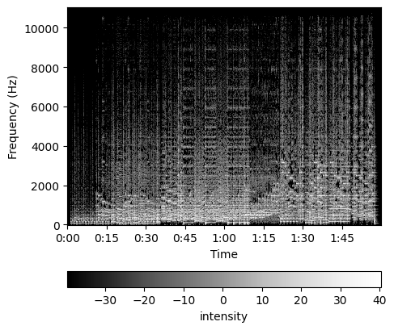

# Audio Classification

|CNN | RNN  | 
|:---:|:---:|
|  |  |
| [Audio as Image](#audio-as-image-cnn) | [Audio as Sequence](#audio-as-sequence-rnn) |

## 1. Audio as Image (Convolutional Neural Network)

  
 
  

## 2. Audio as Sequence (Recurrent Neural Networks)
