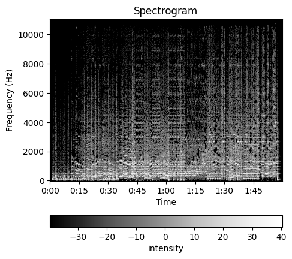

<h1 align="center">
Audio Classification
</h1>
  
<h3 align="center">
Spoken Word Recognition
</h3>

<h5 align="center">
#CNN #AudioSpectrogram
</h5>

## Introduction

Sound waves are represented digitally as audio data, most commonly in waveform. The waveform depicts the amplitude of the sound wave. Another possible representation is the audio spectrogram, which represents the frequencies of sound waves. Examples of these two representations are show below.

In this example we will train a Machine Learning model to recognize spoken words. We will transform waveform sound data into spectrogram image data and so recast the original Audio Classification problem as an Image Classification one.

<figure><center>
   
  <figcaption style="text-align: center">Fig.: Waveplot.</figcaption>
</center></figure>
<figure><center>
   
  <figcaption style="text-align: center">Fig.: Spectrogram.</figcaption>
</center></figure>
## Data

**Free Spoken Digits (FSD)** is a dataset for **Spoken Word Recognition** [1,2]. The dataset is a collection of 3,000 audio files (`.wav`) from 6 speakers. There are 50 recordings per speaker for each digit 0-9. This is a subset of 10% of the **AudioMNIST** dataset proposed in [3,4].

**Sources**
- [1] https://www.kaggle.com/datasets/joserzapata/free-spoken-digit-dataset-fsdd
- [2] https://github.com/Jakobovski/free-spoken-digit-dataset
- [3] https://arxiv.org/abs/1807.03418
- [4] https://github.com/soerenab/AudioMNIST

Taking the spectrograms as images, it is in principle possible to tackle spoken digit classification as an image classification problem - provided that the different digits have different spectral signatures. From the figure we can identify clear differences between the spectrograms of two digits (uttered by the same speaker):

<figure><center>
   
  <figcaption>Fig.: Spectrograms of two different digits uttered by the same speaker.</figcaption>
</center></figure>

and in the figure below we can see some consistency in the spectrograms within each class:

<figure><center>
   
  <figcaption>Fig.: Spectrograms of multiple audio samples (rows) uttered by the same speaker for each of the 10 digits (columns) in the dataset.</figcaption>
</center></figure>

The spectrograms shown above are Short Time Fourier Transforms (STFT). Other spectral decompositions or feature extraction techniques for audio data could also be used to generate image-like features from audio signals, a common one being Mel Frequency Cepstral Coefficients (MFCC):

<figure><center>
   
  <figcaption>Fig.: Mel Frequency Cepstral Coefficient (MFCC) features.</figcaption>
</center></figure>

The datset will consist of pairs of samples `(x,y)` where `x` is a 64x64 spectrogram greyscale image and `y` is the corresponding class label (0-9).

By converting the audio signal to a spectrogram image, we have effectively reframed audio classification as an image classification problem. Since our data is now images, we are able to use Machine Learning methods typically used in Computer Vision.


## Model

We will use a Convolutional Neural Network (CNN) with four convolutional blocks for feature extraction, followed by a fully connected layer for classification. Each convolutional block also includes an activation (ReLU) and a pooling operation (MaxPool). The model has ~84K parameters and the architecture is detailed below:

```
CNN(
  (conv1): Sequential(
    (0): Conv2d(1, 16, kernel_size=(5, 5), stride=(1, 1), padding=(2, 2))
    (1): ReLU()
    (2): MaxPool2d(kernel_size=2, stride=2, padding=0, dilation=1, ceil_mode=False)
  )
  (conv2): Sequential(
    (0): Conv2d(16, 32, kernel_size=(5, 5), stride=(1, 1), padding=(2, 2))
    (1): ReLU()
    (2): MaxPool2d(kernel_size=2, stride=2, padding=0, dilation=1, ceil_mode=False)
  )
  (conv3): Sequential(
    (0): Conv2d(32, 64, kernel_size=(3, 3), stride=(1, 1), padding=(2, 2))
    (1): ReLU()
    (2): MaxPool2d(kernel_size=2, stride=2, padding=0, dilation=1, ceil_mode=False)
  )
  (conv4): Sequential(
    (0): Conv2d(64, 64, kernel_size=(3, 3), stride=(1, 1), padding=(2, 2))
    (1): ReLU()
    (2): MaxPool2d(kernel_size=2, stride=2, padding=0, dilation=1, ceil_mode=False)
  )
  (fc): Linear(in_features=1600, out_features=10, bias=True)
)
```


## Training


The model is trained for 30 epochs using Cross Entropy loss. No data augmentations were used but images are normalized to mean 0 and standard deviation 1. The training/validation split is 90%/10%, meaning 2,700 training samples and 300 validation samples.
The run is done within the DeepLightning framework using the command
```bash
bash ./train.sh configs/AudioClassification_cnn.yaml
```
All hyperparameters can be found in the `.yaml` configuration file. 

The results, shown below, show that the model has learned to distinguish the different classes of spoken digits based on their spectrograms with 96.4% validation accuracy.

<figure><center>
        
        
        <figcaption style="text-align: center">Fig.: Loss and Accuracy of classification model during training.</figcaption>
</center></figure>

The Confusion Matrices below reveal something interesting: utterances of the digit 8 are often misclassified as the digit 6. This would be natural when classifying images of digits because of their visual similarity, but this result could suggest that the similarity also exists in the speech domain. However, this may just be the result of higher variability in the utterances of digits 8, as seems to be the case (see Fig. above depicting samples per class). Notice that the reverse is not true: utterances of the digit 6 are never misclassified as 8. A similar comment could be made about 9 being misclassified as 0.

<figure><center>
        
        <figcaption style="text-align: center">Fig.: Confusion Matrices for models without (left) and with (right) Dropout regularization.</figcaption>
</center></figure>

## Conclusion

We have created a model that successfully learned to predict spoken words from audio spectrograms. An alternative way to tackle the problem of audio classification is to employ a sequence model such as a Recurrent Neural Network (RNN), which we will explore in another example.

Additionally, there is some evidence of overfitting as shown by an a slight increase in the validation loss towards the end of training as well as the gap between training and validation loss. Applying regularization such as Dropout and using Data Augmentations should help minimize the effect of overfitting and improve the robustness the model.
