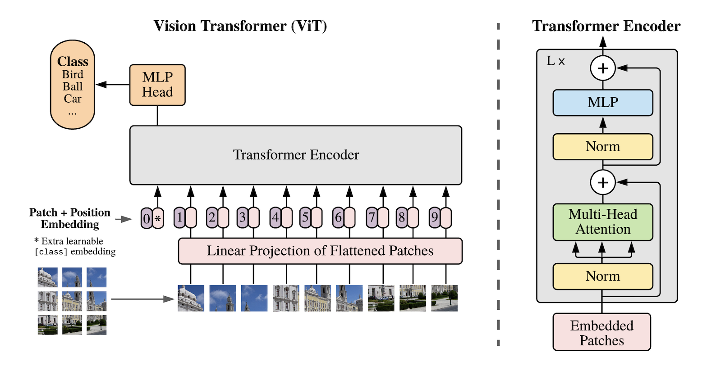

<h1 align="center">
Image Classification
</h1>
  
<h3 align="center">
Object Recognition
</h3>

<h5 align="center">
#ViT #MLPMixer   
</h5>

 

 

|  Model  | Parameters   | Setting |
|:--------|:------------:|:--------|
| ResNet18 | 11.2M | |
| EfficientNet_B0 | 4.0M | |
| MLPMixer | 1.7M | dim=512, depth=6, patch_size=4 |
| ViT | 1.2M | embed_dim=128, hidden_dim=512, num_heads=8, num_layers=6, patch_size=4 |
| SymbolCNN | 28K |  |
